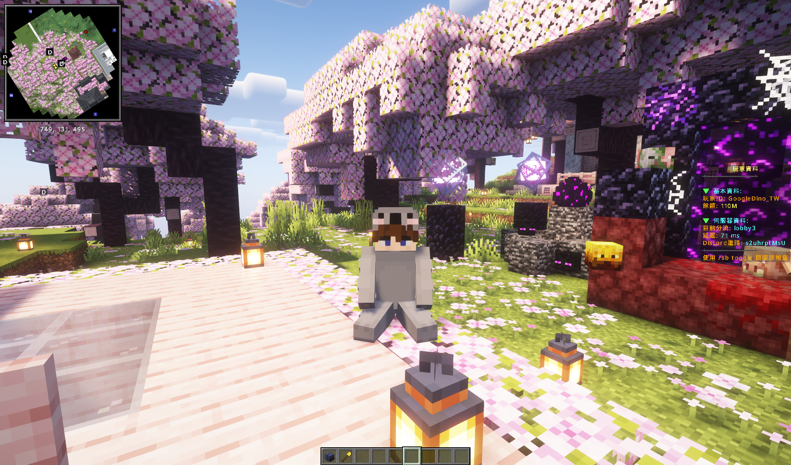
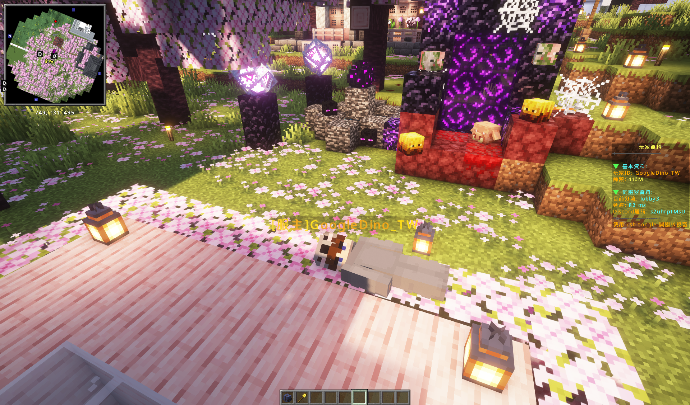
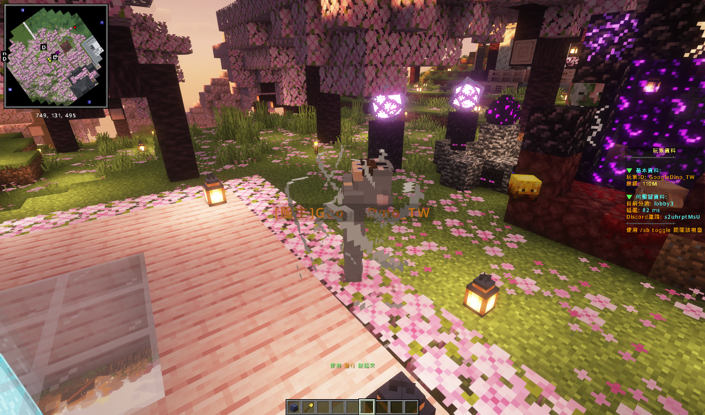

# 玩家姿勢

`/sit` 坐下

<figure><figcaption></figcaption></figure>

`/lay` 躺下

<figure><figcaption></figcaption></figure>

`/bellyflop` 趴下

<figure><figcaption></figcaption></figure>

`/spin` 旋轉

<figure><figcaption></figcaption></figure>
